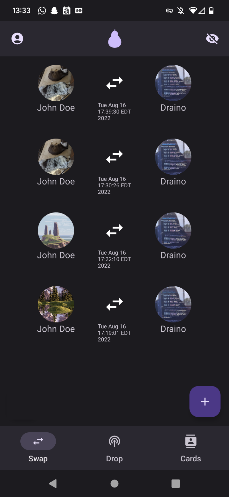
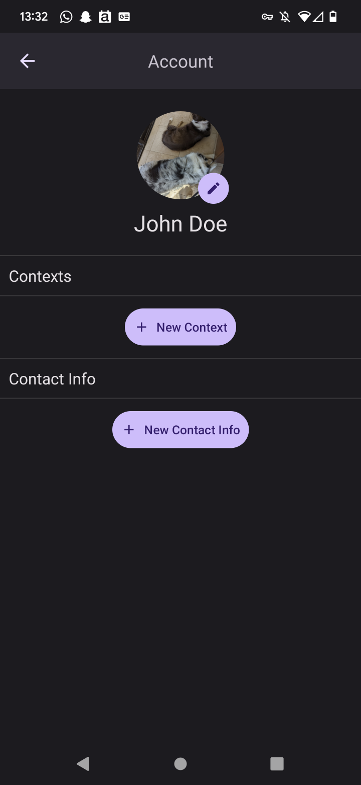
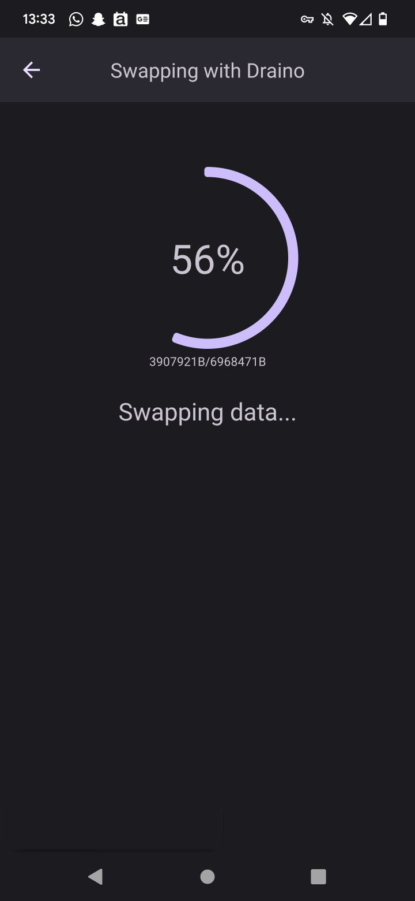

# Pair 
**An Android app that sends data without an internet connection**

## Overview
This app, and the [API](https://github.com/fitebone/pair-api), was derived from my university capstone project for my BSCS. It sends data using WiFi LAN, BLE, and other mediums via the Google Nearby Connections platform. I have found this platform to be suitable only for Android development and aspire to develop my own alternative in the near future. This version of the app does not use the API designed for it. The app is now intended to execute while fully offline.

## Features
- Create a "card" that represents your identity
- Add profile picture and contact information to card
- Exchange cards with another user without any internet connection
- See data transfer progress real time

## Screenshots
         

## License
GPL-3.0 License. See `LICENSE.txt` for more information.
